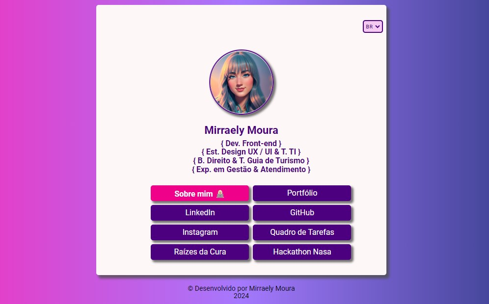
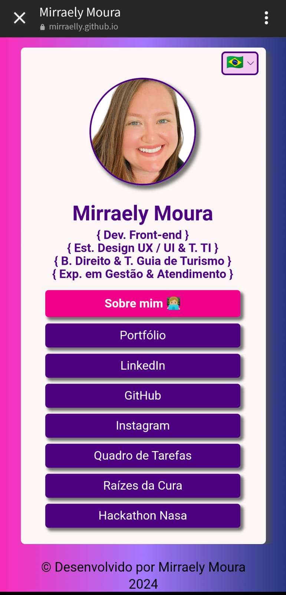
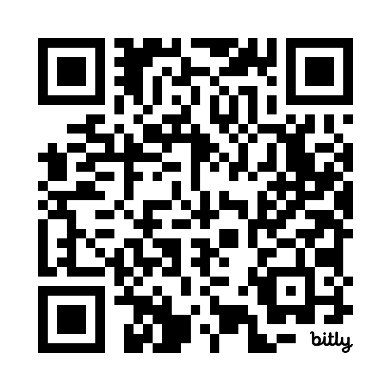

# Cartão de Apresentação 

O **Cartão de Apresentação** é um projeto de iniciativa própria que visa a prática e o aprimoramento do conhecimento em tecnologias frontend por mim estudadas.
Ele traz uma representação moderna e interativa de um cartão de visitas tradicional, mostrando de forma sucinta as
informações e alguns links de projetos e redes importantes para um contato inicial e/ou profissional.

## Objetivos do projeto 

* Aprendizado contínuo, uma vez que trata-se uma projeto cujo objetivo é a prática e o aperfeiçoamento do conhecimento das tecnologias estudadas;
* Boas práticas do código, pois incentiva a constante codificação e organização dos arquivos;
* Estimula às práticas de demonstrações tecnológicas, já que permite uma maior interatividade e responsividade;
* Fácil acesso de links e informações importantes, como apresentação pessoal.

## Tecnologias utilizadas

<div style="display: inline_block"><br>
  
  
  
  
</div><br>

* HTML: Para estruturação do conteúdo do cartão.
* CSS: Visando a estilização e responsividade do layout.
* JavaScript: Com funcionalidades interativas e manipulação dinâmica do conteúdo.
* JSON: Armazenamento de dados e imagens.

## Deploy disponível 

[Cartão de Apresentação](https://bit.ly/mirraely)

## A organização do site

### Repositórios

```
/
├── assets/
│   ├── css/
│   │   ├── reset.css
│   │   └── style.css
│   ├── images/
│   │   └── (imagens usadas no site)
│   └── data.json
├── js/
│   └── informations.js
├── index.html
└── README.md
```

### Telas

 

  <div align="center">
  <br>
    <em>Visualização da tela via Web</em> 
  </div>
  <br><br>
  <div align="center">
  <br>
     <em>Visualização da tela via Celular</em> 
 </div>
 
  <div align="center">
  <br>
     <em>QR Code de Acessor</em> 
 </div>
 
 
## Utilização 

  O cartão está disponível em 4 idiomas os quais já tive contato (inglês, português, espanhol e francês),
  sendo possível o usuário escolher em qual deles deseja ler as informações disponíveis. Obs.: Caso esteja
  visualizando o Deploy através de um Android, a opção de cada idioma é representada por uma bandeira de um país que fala aquele idioma.

  De início, há uma animação que fica alternando entre um avatar e uma foto da desenvolvedora, o que dá um ar mais dinâmico e tecnologico à página.
  Logo após o nome e as skills, há destaques para as qualificações, os interesses, as diversidades de conhecimentos e as habilidades e evidencia as competências e experiências profissionais vivenciadas. 
  
  Logo abaixo, temos uma "caixa" com links disponíveis. No primeiro deles, conseguimos verificar uma breve apresentação pessoal, com um botão para "fechar" essa apresentação.
  Já nos demais, é possível acessar links externos de redes sociais e projetos desenvolvidos.  
  

## Considerações finais

Este projeto me ajudou de forma significativa a desenvolver e praticar minhas habilidades como programadora frontend, assim como criar e personalizar o meu próprio cartão de visitas, 
de forma profissional e interativa, centralizando as minhas informações e links mais importantes, além de contribuir para o meu portfólio pessoal.

Assim como os demais projetos, este está aberto a sugestões e contribuições. Então, fique à vontade de sugerir melhorias e contribuir com novas funcionalidades e/ou correções de bugs.
  
## Contato

* LinkedIn: [https://www.linkedin.com/in/mirraely/](https://www.linkedin.com/in/mirraely/)
* GitHub: [https://github.com/mirraelly](https://github.com/mirraelly)
* Instagram: [https://www.instagram.com/mirraely__/](https://www.instagram.com/mirraely__/)

## Outras tecnologias utilizadas

* Imagem do Avatar produzido com IA
* QRCode produzido por meio meio de ferramenta de encurtador de link: Bitly
